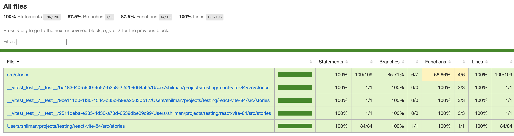

# React + TypeScript + Vite

Reproduction:

1. Create empty directory
2. `npx storybook@latest init` => React + vite + TS
3. `npx storybook add @storybook/experimental-addon-test`
4. `npx vitest --coverage`
5. `npx http-server coverage`

Coverage contains weird story paths:

